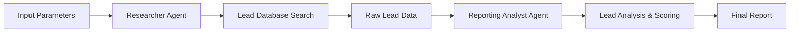

# 🚀 LeadGen - AI-Powered Lead Generation Agent

A sophisticated lead generation system built with CrewAI that automatically finds and analyzes potential leads for AI Agent Development services using intelligent AI agents.

## 📋 Table of Contents

- [Overview](#overview)
- [Features](#features)
- [Architecture](#architecture)
- [Installation](#installation)
- [Configuration](#configuration)
- [Usage](#usage)
- [Project Structure](#project-structure)
- [Agents & Tasks](#agents--tasks)
- [Output](#output)
- [Troubleshooting](#troubleshooting)
- [Contributing](#contributing)
- [License](#license)

## 🎯 Overview

LeadGen is an automated lead generation system that leverages the power of CrewAI framework to:

- **Research** potential leads in the AI Agent Development space
- **Analyze** and prioritize leads based on relevance and potential
- **Generate** comprehensive reports with actionable insights
- **Save time** by automating the entire lead discovery process

## ✨ Features

- 🔍 **Intelligent Lead Research**: Uses Apify actors to search freelancer platforms
- 📊 **Advanced Analytics**: AI-powered lead scoring and prioritization
- 📝 **Automated Reporting**: Generates detailed markdown reports
- 🎯 **Targeted Search**: Customizable search parameters for specific niches
- 💾 **Data Persistence**: Saves results with timestamps for tracking
- 🔄 **Sequential Processing**: Efficient agent collaboration workflow

## 🏗️ Architecture

The system consists of two specialized AI agents working in sequence:



## 🛠️ Installation

### Prerequisites

- Python 3.8+
- CrewAI framework
- Groq API key
- Apify API token (optional)

### Step 1: Clone the Repository

```bash
git clone https://github.com/yourusername/leadgen-crewai.git
cd leadgen-crewai
```

### Step 2: Create Virtual Environment

```bash
python -m venv leadgen_env
source leadgen_env/bin/activate  # On Windows: leadgen_env\Scripts\activate
```

### Step 3: Install Dependencies

```bash
pip install -r requirements.txt
```

### Step 4: Set Up Environment Variables

Create a `.env` file in the root directory:

```env
GROQ_API_KEY=your_groq_api_key_here
MODEL=llama3-8b-8192
APIFY_API_TOKEN=your_apify_token_here
```

## ⚙️ Configuration

### Agent Configuration (`config/agents.yaml`)

```yaml
researcher:
  role: >
    {topic} Senior lead Researcher
  goal: >
    Find the current and present leads related to topic {topic}
  backstory: >
    You're a seasoned researcher with a knack for uncovering the latest
    leading opportunities in {topic}. Known for your ability to find the most relevant
    information and present it in a clear and concise manner.

reporting_analyst:
  role: >
    {topic} Reporting Analyst
  goal: >
    Create detailed reports based on {topic} leads and roles
  backstory: >
    You're a meticulous Lead Analyst with a keen eye for detail. You're known for
    your ability to choose the best leads according to user requests and transform
    them into clear and concise reports, making it easy for others to understand
    and act on the information you provide.
```

### Task Configuration (`config/tasks.yaml`)

```yaml
research_task:
  description: >
    Search and research current leads related to {topic} in the {role} field.
    Focus on finding active job postings, freelance opportunities, and potential clients
    looking for {role} services. Use the search tool to gather comprehensive data.
  expected_output: >
    A detailed list of potential leads including:
    - Company/client names
    - Contact information (if available)
    - Project descriptions
    - Budget ranges
    - Posting dates and deadlines
    - Relevance scores

reporting_task:
  description: >
    Analyze the research data and create a comprehensive lead generation report.
    Prioritize leads based on relevance, budget, and feasibility for {role} professionals.
    Include actionable insights and recommendations.
  expected_output: >
    A well-structured markdown report containing:
    - Executive summary of findings
    - Top 10 prioritized leads with detailed analysis
    - Market insights and trends
    - Actionable next steps for lead conversion
    - Contact strategies and timing recommendations
```

## 🚀 Usage

### Basic Usage

```bash
python main.py
```

### Custom Parameters

Modify the `inputs` dictionary in `main.py`:

```python
inputs = {
    'topic': 'AI Agents',
    'role': 'AI Agent Development',
    'location': 'Remote',
    'budget_min': 1000,
    'max_results': 50
}
```

### Advanced Usage

```python
from leadgen.crew import Leadgen

# Create custom inputs
custom_inputs = {
    'topic': 'Machine Learning',
    'role': 'ML Engineer',
    'location': 'United States',
    'budget_min': 5000,
    'max_results': 25
}

# Run the crew
leadgen = Leadgen()
result = leadgen.crew().kickoff(inputs=custom_inputs)
```

## 🤖 Agents & Tasks

### Researcher Agent
- **Role**: Senior Lead Researcher
- **Responsibility**: Search and gather potential leads
- **Tools**: Apify Actors Tool for freelancer job search
- **Output**: Raw lead data with relevant information

### Reporting Analyst Agent
- **Role**: Lead Reporting Analyst  
- **Responsibility**: Analyze and prioritize leads
- **Tools**: Advanced AI analysis capabilities
- **Output**: Structured markdown report with insights

### Tasks Flow
1. **Research Task**: Gathers raw lead data from various sources
2. **Reporting Task**: Processes and analyzes the data into actionable insights

## 📊 Output

The system generates timestamped reports in the `reports/` directory:

```
reports/
├── lead_report_20240905_143022.md
├── lead_report_20240905_151045.md
└── ...
```

### Sample Report Structure

```markdown
# Lead Generation Report - AI Agents

## Executive Summary
- Total leads found: 47
- High-priority leads: 12
- Average budget: $3,500
- Top platforms: Upwork, Freelancer, Fiverr

## Top 10 Priority Leads
1. **Project Name**: AI Chatbot Development
   - Budget: $5,000-$8,000
   - Deadline: 2 weeks
   - Contact: john.doe@company.com
   - Score: 9.2/10

## Market Insights
- Increased demand for AI agents in e-commerce
- Average project duration: 3-4 weeks
- Most requested skills: Python, OpenAI API, LangChain

## Next Steps
1. Contact top 5 leads within 24 hours
2. Prepare portfolio showcasing similar projects
3. Schedule follow-up for pending proposals
```

## 🔧 Troubleshooting

### Common Issues

**1. Import Errors**
```bash
ModuleNotFoundError: No module named 'crewai'
```
**Solution**: Install CrewAI: `pip install crewai`

**2. API Key Issues**
```bash
ValueError: GROQ_API_KEY environment variable is required
```
**Solution**: Ensure your `.env` file contains valid API keys

**3. Configuration Not Found**
```bash
FileNotFoundError: config/tasks.yaml not found
```
**Solution**: Create the missing configuration files as shown above

**4. Tool Initialization Errors**
```bash
ApifyActorsTool initialization failed
```
**Solution**: Check your Apify API token and actor name

### Debug Mode

Enable verbose logging by setting:
```python
verbose=True  # In crew configuration
logging.basicConfig(level=logging.DEBUG)  # In main.py
```

## 📈 Performance Tips

- **Optimize Search Parameters**: Use specific keywords to reduce irrelevant results
- **Batch Processing**: Process multiple topics in sequence for efficiency  
- **Cache Results**: Enable caching to avoid redundant API calls
- **Monitor Rate Limits**: Be mindful of API rate limits for external services

## 🤝 Contributing

1. Fork the repository
2. Create a feature branch (`git checkout -b feature/amazing-feature`)
3. Commit your changes (`git commit -m 'Add amazing feature'`)
4. Push to the branch (`git push origin feature/amazing-feature`)
5. Open a Pull Request

### Development Setup

```bash
# Install development dependencies
pip install -r requirements-dev.txt

# Run tests
python -m pytest tests/

# Format code
black leadgen/
flake8 leadgen/
```

## 📝 Requirements

```txt
crewai>=0.28.8
crewai[tools]>=0.1.40
langchain-groq>=0.1.5
python-dotenv>=1.0.0
pyyaml>=6.0.1
```

## 🔒 Environment Variables

| Variable | Description | Required | Default |
|----------|-------------|----------|---------|
| `GROQ_API_KEY` | Groq API key for LLM | Yes | - |
| `MODEL` | Groq model name | No | `llama3-8b-8192` |
| `APIFY_API_TOKEN` | Apify API token | No | - |

## 📄 License

This project is licensed under the MIT License - see the [LICENSE](LICENSE) file for details.

## 🙏 Acknowledgments

- [CrewAI](https://github.com/joaomdmoura/crewAI) - Multi-agent framework
- [Groq](https://groq.com/) - Fast LLM inference
- [Apify](https://apify.com/) - Web scraping platform

## 📞 Support

If you encounter any issues or have questions:

1. Check the [Troubleshooting](#troubleshooting) section
2. Search existing [GitHub Issues](https://github.com/yourusername/leadgen-crewai/issues)
3. Create a new issue with detailed information
4. Join our [Discord Community](https://discord.gg/crewai) for real-time help

---

**Made with ❤️ by [Your Name]**

⭐ **Star this repo if you find it useful!**